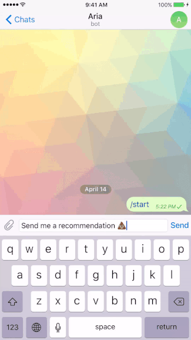

# Bot Server
Example server-side infrastructure for building and supporting conversational interfaces. If you want to find out more, check out my Medium posts [here]().

This particular example of the server provides Spotify music recommendations when you talk to your bot. If you want to try the bot out without running the server, send a message to [@HelloAriaBot](telegram.me/HelloAriaBot) on Telegram.

### Installation
##### Node
Run `$ npm install`

#### Telegram
1. Go into Telegram, talk to [BotFather](telegram.me/botfather).
2. Create a new bot.
3. Take the telegram token and add it to your environment variables or update `/config/index.js`
4. If you want to set your environment variable run `$ export TELEGRAM_TOKEN=your_token_here`

#### Spotify
1. Go to [developer.spotify.com](https://developer.spotify.com/)
2. Create a new app
3. Get the client id and secret and add it to your environment variables or update `/config/index.js`
4. Run `$ export SPOTIFY_CLIENT_ID=your_client_id_here`
5. Run `$ export SPOTIFY_CLIENT_SECRET=your_client_secret_here`

### Running
1. Run `$ npm start`
2. Text the bot you made during the installation process
3. Enjoy Spotify music recommendations

### Demo

